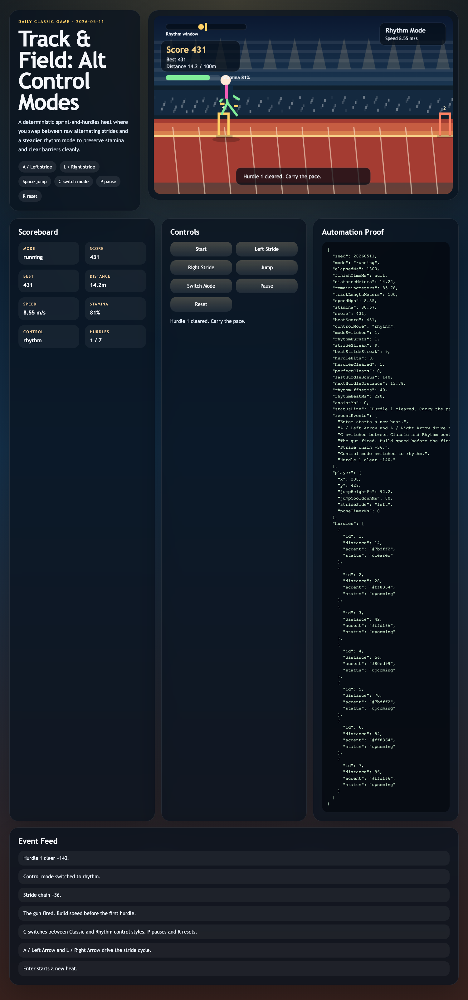
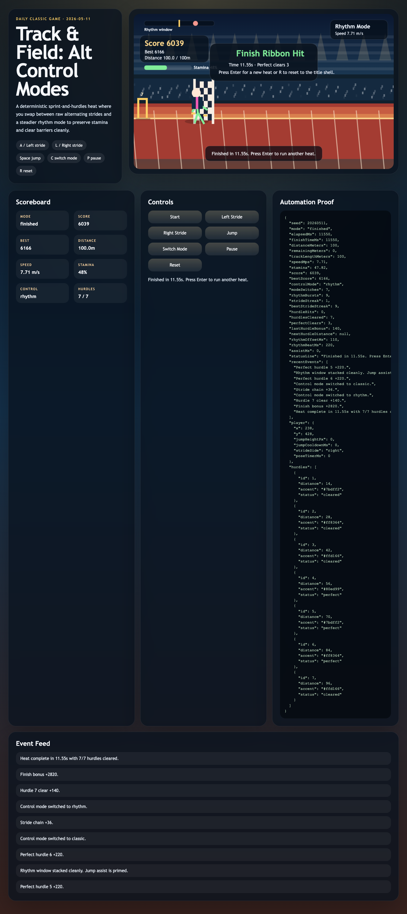

# daily-classic-game-2026-05-11-track-and-field-alt-control-modes

<p align="center"><strong>Track &amp; Field reimagined as a deterministic 100m hurdles heat with two control styles: raw Classic sprint taps and a steadier Rhythm recovery mode.</strong></p>

<p align="center">
  
  
</p>

## Quick Start

```bash
pnpm install
pnpm dev
pnpm test
pnpm capture
```

## How To Play

- Press `Enter` or click `Start` to fire the gun and launch the heat.
- Tap `A` or `Left Arrow`, then `L` or `Right Arrow`, in alternation to accelerate in Classic mode.
- Hit `C` to switch into Rhythm mode when you want steadier pace control, jump assist, and stamina recovery.
- Press `Space` to jump hurdles.
- Press `P` to pause and `R` to reset back to the title shell.

## Rules

- The run is a single 100m heat with seven hurdles placed at fixed splits: `14m`, `28m`, `42m`, `56m`, `70m`, `84m`, and `96m`.
- Classic mode gives the highest acceleration, but it drains stamina faster and punishes repeated same-side taps.
- Rhythm mode slows the pace ceiling, but beat-matched taps refill stamina, stack jump assist, and make clean clears easier.
- A hurdle hit costs score, speed, and stamina, but the run continues unless stamina fully collapses.
- The heat ends when you hit the finish ribbon or when stamina reaches zero.

## Scoring

- Forward progress awards score continuously as the runner covers meters.
- Clean hurdle clears award `+140`.
- Perfect hurdle clears award `+220`.
- Every six strong Classic alternations award a `+36` stride-chain bonus.
- The finish bonus combines time, remaining stamina, a clean-run bonus, and a mode-usage bonus.

## Twist

`Alt control modes`

The twist turns Track &amp; Field into a tactical mode-switching heat instead of a pure button mash. Classic mode is for explosive sprint speed. Rhythm mode is for pulse-timed recovery, safer jump setup, and preserving enough energy to reach the ribbon with a strong finish bonus.

## Verification

- `pnpm test`
- `pnpm build`
- `pnpm capture`
- Browser hooks:
  `window.advanceTime(ms)` advances the deterministic simulation.
  `window.render_game_to_text()` returns the current proof payload as JSON text.
- The scripted verification path finishes the race in `11.55s`, clears all `7` hurdles, records `3` perfect clears, and preserves pause state without advancing elapsed time.
- Playwright artifacts:
  `artifacts/playwright/shot-0-title.png`
  `artifacts/playwright/shot-1-first-hurdle.png`
  `artifacts/playwright/shot-2-paused.png`
  `artifacts/playwright/shot-3-finish.png`
  `artifacts/playwright/shot-4-reset-title.png`
  `artifacts/playwright/render_game_to_text.txt`
  `artifacts/playwright/action_payload.json`

### GIF Captures

- `Opening gates`: `assets/gifs/clip-01-opening-gates.gif`
- `Rhythm hurdle`: `assets/gifs/clip-02-rhythm-hurdle.gif`
- `Finish reset`: `assets/gifs/clip-03-finish-reset.gif`

## Project Layout

```text
src/                 deterministic game core, renderer, and autoplay proof path
scripts/             self-check and Playwright capture entry points
tests/               simulation-level automation tests
artifacts/playwright/ screenshots, state dumps, and action payloads
assets/gifs/         exported GIF clips for the README
docs/plans/          run-local implementation plan
```
